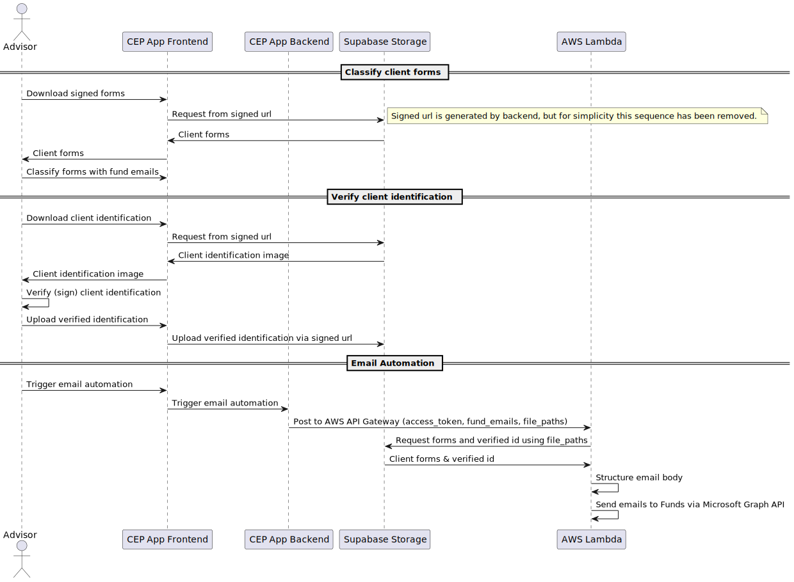

# Client information processing
The client's information is processed by the Financial Advisor.
The advisor is provided a dashboard to have an overview of their clients, they also have pages to edit their own information and action the submitted forms from their clients.

This page details the process advisors go through to verify client information, classify submitted documents, and trigger the automatic email process to take place.

## Overview
High level overview is described by the table below:

| Step | Description |
| --- | --- |
| 1. | Download signed client forms (images) |
| 2. | Associate the uploaded forms with the corresponding Superanuation/Insurance fund |
| 3. | Download client identification (image) |
| 4. | Verify client id |
| 5. | Upload verified id |
| 6. | Trigger email process |

## Sequence Diagram
This process is detailed more clearly in the sequence diagram below:

