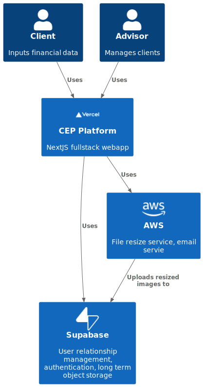
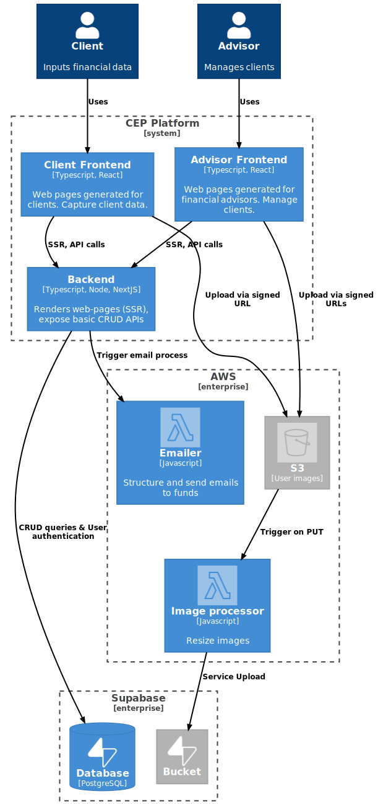

# Financial Advisor CEP
Financial Advisor Client Engagement Platform.

The platform aims to help Financial Advisors by eliminating some of the friction experienced when on-boarding new clients. Especially the process of data capture, and communication with Superannuation/Insurance funds. 

# 1. Introduction
For Financial Advisors to give financial advice, they typically need to access a client's superannuation/insurance policy information.
For this to happen, the advisor would send the client a third party consent form, the client would put in their policy information, sign, and send it back to the advisor.
After the financial advisor has received the signed third party consent form, they would verify the information and send it off to the client's policy's for verification.
This process is all done via email and is slow and error prone.

To reduce the overall friction of this process, a web application was created that serves the 2 types of users (financial advisors & clients) and aims to do the following:

- Allow advisors to register new clients (via name and email)
- Provide set forms to capture client information reliably
- Automatically populate third-party-consent form
- Handle image uploads of the signed client forms
- Allow advisors to verify client information
- Automate advisor emails to the client's super/insurance companies

# 2. Architecture
The CEP was written using **NextJS** and is hosted on **Vercel**.
Hosting on Vercel has its limitations (free tier hosting limits process execution time) and has driven multiple design decisions.
This includes breaking out CPU intensive functionality to AWS lambdas.

## 2.1 Context Diagram
Context diagram shows the interaction between all systems involved in the web app.

## 2.2 Container Diagram
Container diagram provides more details on the internal operation of all systems involved in the web app.

## 3. Use Cases
Some example use cases have been described here:

1. [Login](./use-cases/login.md)
1. [Client info capture](./use-cases/client-info-capture.md)
1. [Client info processing](./use-cases/client-info-processing.md)

**Note:** it is recommended that the use-cases be followed in order, as the previous use-case provides context for the next.
