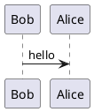

# Testing!!!



# Architecture

```puml
@startuml
!includeurl https://raw.githubusercontent.com/plantuml-stdlib/C4-PlantUML/master/C4_Context.puml

Person(client, "Client", "Inputs financial data")
Person(advisor, "Advisor", "Manages clients")

System(cep, "CEP Platform", "Engagement and data capture")

Rel(client, cep, "Uses")
Rel(advisor, cep, "Automates emails and reviews data")
@enduml
```

## Following text
