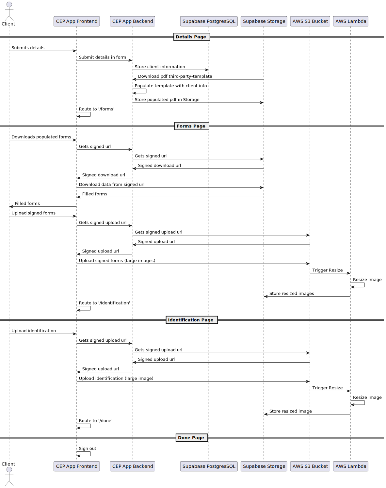

# Client info capture
The client is guided through a wizard-like interface, each page collects some information of the client and redirects the client to the next.

## Overview
High level overview is described by the table below:

| Step |  Description |
| --- |  --- |
| 1. | Collect client information [Name, Address, Policy Name(s), Account Number(s)] |
| 2. | Download pre-filled third-party-consent form, sign, upload |
| 3. | Upload photo identification of client |
| 4. | Allow client to sign-out or go back to previous steps |

## Sequence Diagram
This process is detailed more clearly in the sequence diagram below:

