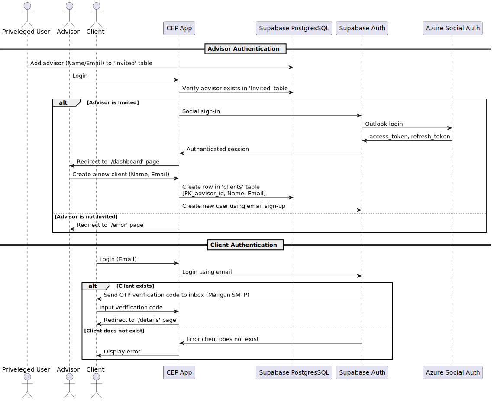

# Login
The login process for advisors and clients are quite different.

Advisors login using social-auth with their outlook account.

Outlook social sign-in is used because after logging in, the app receives an **access_token** which can be used by **Microsoft Graph API** to send emails on behalf of the logged-in advisor.
Outlook is also very commonly used in professional industries and would target the most amount of advisors.

The client login process is designed to be easy. A client does not need to sign-up, rather they just use their email and input a verification code sent to that email.

The login process is described by the sequence diagram below:

